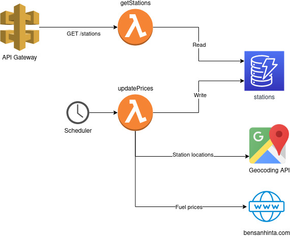

# polttoaine-saa-backend

This is the backend service for fuel price weather map service: https://marcholio.github.io/polttoaine-saa-frontend. It shows fuel prices in Espoo as a heatmap, indicating where the highest prices are.

## Overall design

The backend consists of two parts: GET /stations endpoint and integration services. The integrations fetch their data from https://bensanhinta.com (fuel prices) and Google maps Geocoding API (station coordinates). See architecture diagram below for further info.



## Setting up development environment

### Prerequisites

- [Yarn](https://yarnpkg.com/)
- [Node](https://nodejs.org/en/)
- [serverless](https://www.serverless.com/)
- [AWS account](https://aws.amazon.com/)
- [AWS cli](https://aws.amazon.com/cli/)
- [Google maps Geocoding API key](https://developers.google.com/maps/documentation/geocoding/overview)

### Installation

Install dependencies:

```
yarn
```

Create `variables/<env>.yml`file. See template in `variables` folder. Add your geocoding API key to the variables file.

### Deployment

Configure AWS profile. See instructions in [AWS documentation](https://docs.aws.amazon.com/cli/latest/userguide/cli-configure-profiles.html).

Deploy to your AWS account with configured profile:

```
sls deploy --stage <env> --aws-profile <your-profile>
```

## License

Licensed under MIT license. See LICENSE.md for further information.

## Known limitations

- Fuel prices are scraped from a single source, which is not updating that frequently
- Old data is not removed from DB.
